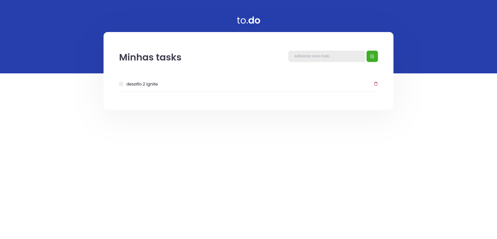
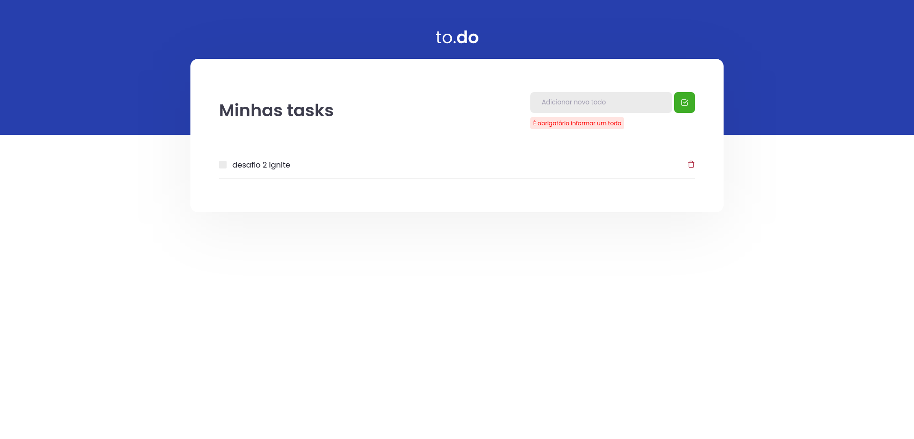

# to.do 💙

<p align="center">
  <a></a>
</p>

<p align="center">
  <a></a>
</p>

## 🛠️ Stack

- React
- Typescript
- Yarn
- Webpack
- SCSS, Babel
- Responsive

## Run

```
    yarn install
    yarn dev
```

## Run tests

```
    yarn test
```

## :woman: Author

[@laisfrigerio](https://github.com/laisfrigerio/)

## 📄 License

This project is licensed under the MIT License - see the LICENSE file for details